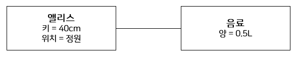
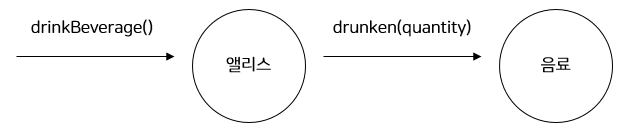

# 02. 이상한 나라의 객체
## 객체, 그리고 소프트웨어 나라

하나의 개별적인 실체로 식별 가능한 물리적인 또는 개념적인 사물은 어떤 것이라도 객체가 될 수 있다. 객체의 다양한 특성을 효과적으로 설명하기 위해서는 객체를 **상태(state), 행동(behavior), 식별자(identity)**를 지닌 실체로 보는 것이 가장 효과적이다.

> **객체**란 식별 가능한 개체 또는 사물이다. 객체는 자동차처럼 만질 수 있는 구체적인 사물일 수도 있고, 시간처럼 추상적인 개념일 수도 있다. 객체는 구별 가능한 식별자, 특징적인 행동, 변경 가능한 상태를 가진다. 소프트웨어 안에서 객체는 저장된 상태와 실행 가능한 코드를 통해 구현된다.
> 

### 상태

객체가 주변 환경과의 상호작용에 어떻게 반응하는가는 그 시점까지 객체에 어떤 일이 발생했느냐에 좌우된다. 여행을 위해 비행기를 이용하려면 탑승 전에 항공권을 발권해야 하며, 발권했으면 비행기에 탑승할 수 있고, 발권하지 못했으면 탑승할 수 없다. 비행기 탑승 여부는 과거에 항공권을 발권하는 행동이 발생했는지 여부에 따라 달라지는 것이다.

이처럼 어떤 행동의 결과는 과거에 어떤 행동들이 일어났었느냐에 의존한다. 비행기에 탑승한다는 행동의 결과를 예상할 수 있는 한 가지 방법은 과거에 탑승권을 발권했는지, 전자티켓으로 발권했는지 살펴보는 것이다. 그러나 이 방법은 과거에 했던 모든 행동을 기억해야만 가능하기 때문에 행동의 결과를 설명하는 것을 매우 어렵게 만든다.

일반적으로 과거에 발생한 행동의 이력을 통해 현재 발생한 행동의 결과를 판단하는 방식은 복잡하고 번거로우며 이해하기 어렵다. 그래서 행동의 과정과 결과를 단순하게 기술하기 위해 **상태**라는 개념이 고안되었다. 비행기 탑승 가능 여부는 항공권의 발권 **상태**를 보고 예측할 수 있다.

상태를 이용하면 과거의 모든 행동 이력을 설명하지 않고도 행동의 결과를 쉽게 예측하고 설명할 수 있다. 또한 과거에 얽매이지 않고 현재를 기반으로 객체의 행동 방식을 이해할 수 있다.

상태는 근본적으로 세상의 복잡성을 완화하고 인지 과부하를 줄일 수 있는 중요한 개념이다.

### 상태와 프로퍼티

위 그림은 앨리스의 상태를 표현한 것이다. 앨리스와 음료는 객체다. 그러나 앨리스의 키와 위치, 음료의 양은 객체가 아닌 단순한 값이다. 따라서 앨리스의 상태는 키와 위치라는 단순한 값과 음료라는 객체의 조합으로 표현할 수 있다. (앨리스는 음료를 가지고 있음)

결론적으로 모든 객체의 상태는 단순한 값과 객체의 조합으로 표현할 수 있다. 이때 객체의 상태를 구성하는 모든 특징을 통틀어 객체의 **프로퍼티(property)**라고 한다. 일반적으로 **프로퍼티**는 변경되지 않고 고정되기 때문에 **정적**이다. 반면 **프로퍼티 값(property value)**은 시간이 흐름에 따라 변경되기 때문에 **동적**이다.

- (키, 위치, 음료가 앨리스의 프로퍼티가 된다)

앨리스와 음료 사이에 존재하는 선은 앨리스가 음료에 관해 알고 있다는 의미다. 이처럼 객체와 객체 사이의 의미 있는 연결을 **링크(link)**라고 한다. 객체와 객체 사이에는 링크가 존재해야만 요청을 보내고 받을 수 있다. 즉, 객체의 링크를 통해서만 메시지를 주고받을 수 있다.

객체를 구성하는 단순한 값은 **속성(attribute)**라고 한다.

- 키, 위치가 앨리스의 속성이 된다.

> **상태**는 특정 시점에 객체가 가지고 있는 정보의 집합으로 객체의 구조적 특징을 표현한다. 객체의 상태는 객체에 존재하는 정적인 프로퍼티와 동적인 프로퍼티 값으로 구성된다. 객체의 프로퍼티는 단순한 값과 다른 객체를 참조하는 링크로 구분할 수 있다.
> 

### 행동

객체의 상태는 저절로 변경되지 않는다. 객체의 상태를 변경하는 것은 개체의 자발적인 행동뿐이다. 객체가 취하는 행동은 객체 자신의 상태를 변경시킨다. 객체의 행동에 의해 객체의 상태가 변경된다는 것은 행동이 **부수 효과(side effect)**를 초래한다는 것을 의미한다. 부수 효과의 개념을 이용하면 객체의 행동을 상태 변경의 관점에서 쉽게 기술할 수 있다.

앨리스가 케이크를 먹는 행위는 앨리스의 키를 작게 변화시키고 케이크의 양을 줄이는 부수 효과를 야기한다. 앨리스가 문을 통과하는 행동은 앨리스의 위치를 변화시키는 부수 효과를 초래한다.

**객체의 행동은 객체의 상태를 변경시키지만 행동의 결과는 객체의 상태에 의존적이다.**

따라서 상태와 행동 사이에는 다음과 같은 관계가 있음을 알 수 있다.

- 객체의 행동은 상태에 영향을 받는다
- 객체의 행동은 상태를 변경시킨다

이것은 상태라는 개념을 이용해 행동을 다음의 두 가지 관점에서 서술할 수 있음을 의미한다.

- 상호작용이 현재의 상태에 어떤 방식으로 의존하는가
- 상호작용이 어떻게 현재의 상태를 변경시키는가

앨리스가 통과해야 하는 문의 크기가 40cm라고 가정하면 문을 통과하는 행동은 과거의 행동을 돌아볼 필요 없이 앨리스의 **키**와 **위치**라는 두 가지 상태를 이용해 간단하게 서술할 수 있다.

- 앨리스의 키가 40cm 이하라면 문을 통과할 수 있다.
- 문을 통과한 후에 앨리스의 위치는 아름다운 정원으로 바뀌어야 한다.

### 협력과 행동

어떤 객체도 섬이 아니다. 객체는 자신에게 주어진 책임을 완수하기 위해 다른 객체를 이용하고 다른 객체에게 서비스를 제공한다. 객체는 다른 객체와 적극적으로 상호작용하며 **협력하는 객체들의 공동체**에 참여하기 위해 노력한다.

객체가 다른 객체와 협력하는 유일한 방법은 다른 객체에게 요청을 보내는 것이다. 요청을 수신한 객체는 요청을 처리하기 위해 적절한 방법(메서드)에 따라 행동한다. 따라서 객체의 행동은 객체가 협력에 참여할 수 있는 유일한 방법이다.

객체는 협력에 참여하는 과정에서 자기 자신의 상태뿐만 아니라 다른 객체의 상태 변경을 유발할 수 있다. (음료를 마시는 앨리스의 행동은 자기 자신뿐만 아니라 음료의 상태 변경도 유발한다)

정리하면 객체의 행동으로 인해 발생하는 결과는 두 가지 관점에서 설명할 수 있다.

- 객체 자신의 상태 변경
- 행동 내에서 협력하는 다른 객체에 대한 메시지 전송

> **행동**이란 외부의 요청 또는 수신된 메시지에 응답하기 위해 동작하고 반응하는 활동이다. 행동의 결과로 객체는 자신의 상태를 변경하거나 다른 객체에게 메시지를 전달할 수 있다. 객체는 행동을 통해 다른 객체와의 협력에 참여하므로 행동은 외부에 가시적이어야 한다.
> 

### 상태 캡슐화

객체지향의 세계에서 모든 객체는 자신의 상태를 스스로 관리하는 자율적인 존재다. 앨리스 객체의 키를 작게 만드는 것이 앨리스 자신인 것처럼 음료 객체의 양을 줄이는 것은 음료 자신이어야 한다. 따라서 앨리스는 직접적으로 음료의 상태를 변경할 수 없고 단지 음료에게 자신이 음료를 마셨다는 메시지를 전달할 수 있을 뿐이다.

앨리스에게 전달되는 메시지는 `drinkBeverage()`이고 음료에게 전달되는 메시지는 `drunken(quantity)`다. 두 메시지를 보고 앨리스의 키가 줄어든다거나 음료의 양이 줄어든다는 상태 변경을 예상할 수 있을까? 메시지를 앨리스에게 전송하는 객체이건 음료에게 메시지를 전송하는 앨리스 객체이건 메시지 송신자는 메시지 수신자의 상태 변경에 대해서는 알지 못한다.

이것이 캡슐화가 의미하는 것이다. 객체는 상태를 캡슐 안에 감춰둔 채 외부로 노출하지 않는다. 객체가 외부에 노출하는 것은 **행동**뿐이며, 외부에서 객체에 접근할 수 있는 유일한 방법 역시 **행동**뿐이다.

***상태를 외부에 노출시키지 않고 행동을 경계로 캡슐화하는 것은 결과적으로 객체의 자율성을 높인다. 자율적인 객체는 스스로 판단하고 스스로 결정하기 때문에 객체의 자율성이 높아질수록 객체의 지능도 높아진다. 협력에 참여하는 객체들의 지능이 높아질수록 협력은 유연하고 간결해진다.***

결론적으로 상태를 잘 정의된 행동 집합 뒤로 캡슐화하는 것은 객체의 자율성을 높이고 협력을 단순하고 유연하게 만든다. 이것이 **상태를 캡슐화해야 하는 이유**다.

### 식별자

객체란 인간의 인지 능력을 이용해 식별 가능한 경계를 가진 모든 사물을 의미한다. 객체가 식별 가능하다는 것은 객체를 서로 구별할 수 있는 특정한 프로퍼티가 객체 안에 존재한다는 것을 의미한다. 이 프로퍼티를 **식별자**라고 한다. 모든 객체는 식별자를 가지며 식별자를 이용해 객체를 구별할 수 있다.

### 행동이 상태를 결정한다

상태를 먼저 결정하고 행동을 나중에 결정하는 방법은 설계에 나쁜 영향을 끼친다.

1. **상태를 먼저 결정할 경우 캡슐화가 저해된다.** 상태에 초점을 맞출 경우 상태가 객체 내부로 깔끔하게 캡슐화되지 못하고 공용 인터페이스에 그대로 노출되어버릴 확률이 높아진다.
2. **객체를 협력자가 아닌 고립된 섬으로 만든다.** 객체가 필요한 이유는 애플리케이션의 문맥 내에서 다른 객체와 협력하기 위해서다. 불행하게도 상태를 먼저 고려하는 방식은 협력이라는 문맥에서 멀리 벗어난 채 객체를 설계하게 함으로써 자연스럽게 협력에 적합하지 못한 객체를 창조하게 된다.
3. **객체의 재사용성이 저하된다.** 객체의 재사용성은 다양한 협력에 참여할 수 있는 능력에서 나온다. 상태에 초점을 맞춘 객체는 다양한 협력에 참여하기 어렵기 때문에 재사용성이 저하될 수밖에 없다.

협력에 참여하는 훌륭한 객체를 만들기 위한 가장 중요한 덕목은 상태가 아니라 행동에 초점을 맞추는 것이다. 객체는 다른 객체와 협력하기 위해 존재한다. 객체의 행동은 객체가 협력에 참여하는 유일한 방법이다. 따라서 **객체가 적합한지를 결정하는 것은 그 객체의 상태라 아니라 행동**이다.

### 은유와 객체

**객체지향이란 현실 세계의 모방**이라고 하는 것은 크나큰 오해다.

안타깝게도 객체지향 세계는 현실 세계의 단순한 모방이 아니다. 소프트웨어 안에 구현된 상품 객체는 실제 세계의 상품과는 전혀 다른 양상으 띤다. 소프트웨어 상품은 실제 세계의 상품이 하지 못하는 가격 계산과 같은 행동을 스스로 수행할 수 있다. 이것은 소프트웨어 상품이 실제 세계의 상품을 단순화하거나 추상화한 것이 아니라 특성이 전혀 다른 어떤 것임을 의미한다.
